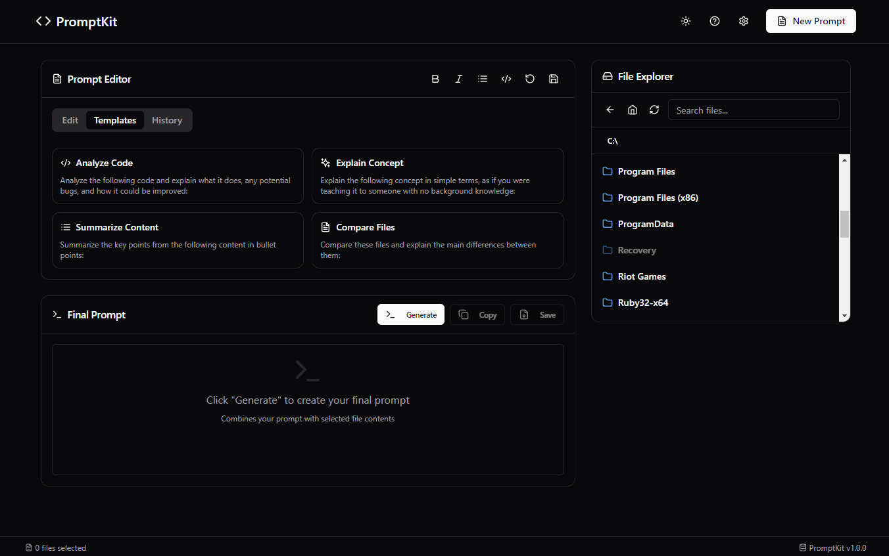

# PromptKit

PromptKit is a desktop application that helps you create enhanced prompts for AI assistants by seamlessly combining your instructions with file contents from your local system.



## Features

- **Intuitive File Browser**: Navigate your file system to select code files, documents, and other text files
- **Smart Prompt Editor**: Write your instructions with formatting tools and templates
- **Live File Preview**: Instantly view file contents before including them
- **Final Prompt Generation**: Automatically combine your instructions with selected file contents in a well-structured format
- **Customization Options**: Configure path display formats, theme preferences, and more
- **Cross-Platform**: Works on Windows, macOS, and Linux

## Installation

### Build from Source

```bash
# Clone the repository
git clone https://github.com/Di-Gi/promptkit.git
cd promptkit

# Install dependencies
npm install

# Start development server (web version)
npm run dev:web

# Start development with Electron
npm run dev:electron

# Build for production
npm run build

# Build Electron app
npm run electron:build
```

## Usage

1. **Write Your Prompt**: Start by writing your instructions in the Prompt Editor
2. **Select Files**: Browse your file system and select files you want to include
3. **Preview Content**: Check file contents in the preview panel
4. **Generate Final Prompt**: Click "Generate" to combine your prompt with the file contents
5. **Copy or Save**: Copy the final prompt to your clipboard or save it for later use with AI assistants

## Templates

PromptKit includes several starter templates for common AI prompting scenarios:

- Analyze Code
- Explain Concept
- Summarize Content
- Compare Files

## Development

### Tech Stack

- React.js
- Electron
- Express.js
- TailwindCSS

### Project Structure

```
promptkit/
├── src/             # Contains the React frontend source code
│   ├── components/  # Reusable React UI components
│   ├── contexts/    # React Context providers for global state management
│   ├── hooks/       # Custom hooks that encapsulate reusable logic
│   └── lib/         # Utility functions and helper modules
├── server.js        # Express server handling backend file operations and API endpoints
└── main.js          # Electron main process that initializes and controls the desktop application
```

## License

This project is licensed under the [APACHE LICENSE 2.0](LICENSE). Please review the LICENSE file for complete details.

## Contributing

Contributions are welcome! For more information on how to get involved, please see our [CONTRIBUTING Guidelines](CONTRIBUTING.md).
